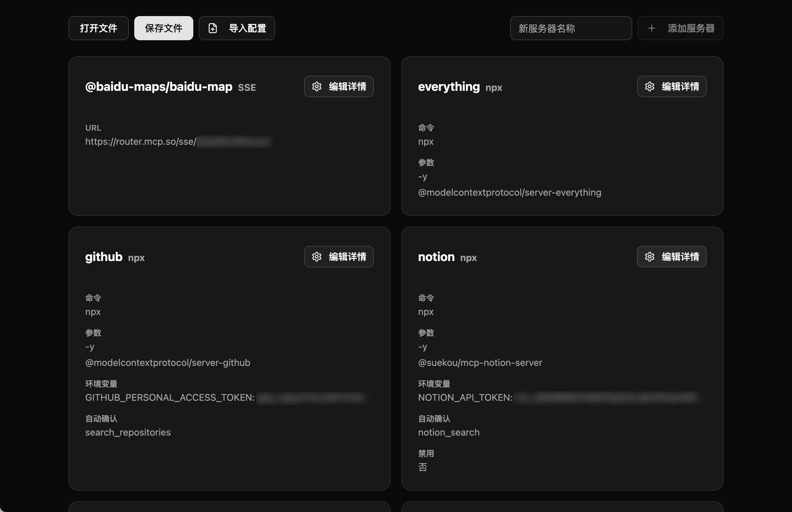

# MCP 配置 GUI

一个用于管理和编辑 MCP (Model Context Protocol) 配置的图形用户界面工具。



## 项目简介

MCP 配置 GUI 是一个基于 Electron 和 React 的桌面应用程序，旨在简化 MCP 配置文件的创建和管理。通过直观的用户界面，您可以轻松地添加、编辑和删除服务器配置，而无需手动编辑 JSON 文件。

## 功能特点

- 📂 打开和保存 MCP 配置文件
- ➕ 添加和管理多个服务器配置
- 🔄 导入现有配置
- 🖊️ 直观地编辑配置参数
- 🌐 支持多种服务器类型 (npx, uvx, node, SSE)
- 🔍 清晰的配置预览
- 🌍 支持多语言界面

## 安装与运行

### 前提条件

- Node.js (推荐 v16 或更高版本)
- npm 或 yarn

### 安装依赖

```bash
# 使用 pnpm
pnpm install
```

### 开发模式

```bash
# 使用 pnpm
pnpm run electron:dev
```

### 构建应用

```bash
# 使用 pnpm
pnpm run electron:build
```

构建后的应用将位于 `release` 目录中。

## 使用指南

1. **启动应用**：运行已安装的应用程序或开发模式
2. **打开配置文件**：点击"打开"按钮选择现有的 MCP 配置文件，或从头开始创建
3. **添加服务器**：输入服务器名称并点击"添加"按钮
4. **编辑配置**：点击每个服务器卡片上的"编辑详情"按钮以修改详细配置
5. **保存配置**：完成编辑后，点击"保存"按钮将配置保存到文件

## 配置参数说明

MCP 配置支持多种服务器类型，每种类型有不同的配置选项：

- **命令行服务器** (npx, uvx, node)
  - `command`: 要执行的命令类型
  - `args`: 命令行参数
  - `env`: 环境变量
  - `autoApprove`: 自动批准的命令列表

- **SSE 服务器**
  - `url`: 服务器 URL
  - `autoApprove`: 自动批准的命令列表

## 技术栈

- [Electron](https://www.electronjs.org/) - 桌面应用框架
- [React](https://reactjs.org/) - 用户界面库
- [TypeScript](https://www.typescriptlang.org/) - 类型安全的 JavaScript
- [Tailwind CSS](https://tailwindcss.com/) - CSS 框架
- [shadcn/ui](https://ui.shadcn.com/) - UI 组件
- [i18next](https://www.i18next.com/) - 国际化框架

## 贡献指南

欢迎提交问题报告和拉取请求。对于重大更改，请先开启一个问题讨论您想要更改的内容。

## 许可证

[MIT](LICENSE) 